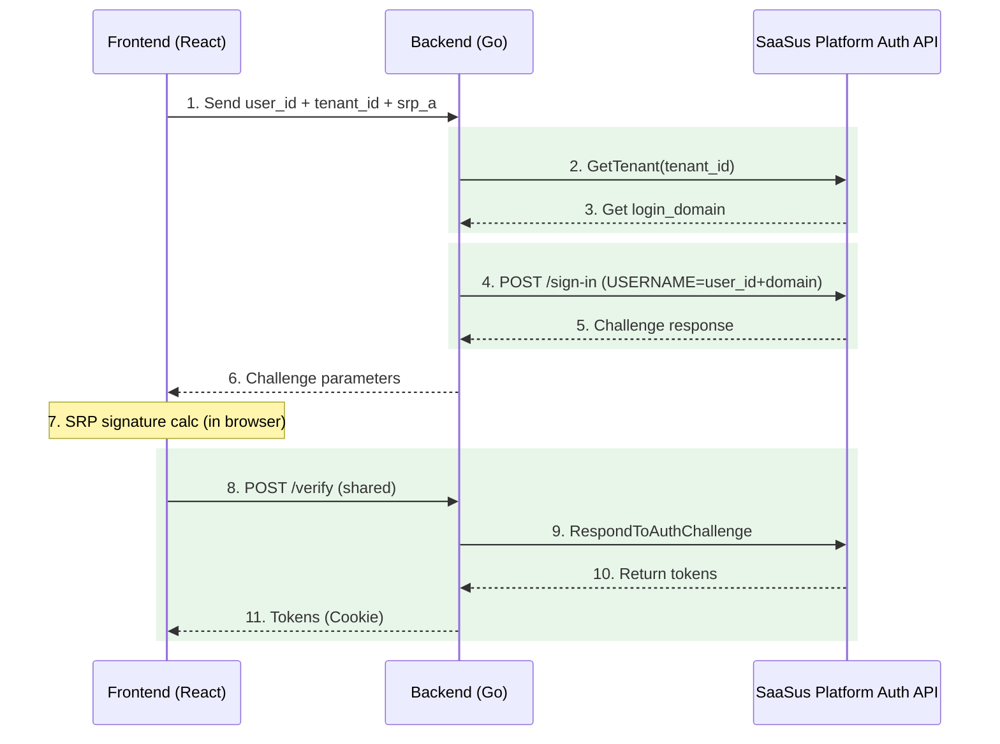

This document explains how to implement an ID-based authentication method that uses **username + tenant ID** instead of email.

ID login can be implemented standalone or alongside email login. The SRP authentication computation and token verification (`POST /verify`) are the same as email login; only the challenge request endpoint and parameters differ.

:::info
For the basic email login implementation, see [Basic Implementation Using the Auth API](/docs/part-6/implementation-guide/auth/basic-sign-in). For an overview of the Auth API, see [Auth API Implementation Guide](/docs/part-6/implementation-guide/auth/overview).
:::

## Overview

ID login leverages the `login_domain` value set in the SaaSus Platform tenant attributes. The backend retrieves tenant information and concatenates `username + login_domain` (e.g., `taro` + `@example.com` = `taro@example.com`) before sending to the SaaSus Platform Auth API.

This allows users to sign in with just a username and tenant ID, without needing to remember a full email address. It is particularly useful for SaaS that operate multiple tenants and want to provide a tenant-isolated login experience.

## Prerequisites

To implement ID login, all of the following prerequisites must be satisfied.

### 1. SaaSus Platform configuration

#### The `login_domain` tenant attribute must be defined

In the SaaS Operation Console under "Tenant attributes", add a tenant attribute named `login_domain`.

- **Attribute name**: `login_domain`
- **Attribute type**: string
- **Value format**: A domain part starting with `@` (e.g., `@example.com`, `@tenant1.example.com`)

:::tip About the value format
Set `login_domain` in a format that **includes the `@` and everything after** the email's local part (e.g., `@example.com`). This ensures that simple concatenation with `user_id` results in a valid email format. If the value omits the `@`, the concatenated string will not be a valid email and authentication will fail.
:::

#### The target tenant must have a `login_domain` value set

Each tenant that should support ID login must have a value configured for the `login_domain` attribute defined above. ID login will fail for tenants where this value is not set.

#### Users must be registered in SaaSus Platform as `username + login_domain`

For example, if a tenant's `login_domain` is `@example.com` and you want users to log in with the ID `taro`, the user must be registered in SaaSus Platform with the email `taro@example.com`.

### 2. Application prerequisites

#### The basic email login implementation must be in place

ID login builds on top of the basic email login mechanism (`POST /sign-in` and `POST /sign-in/challenge`). Complete [Basic Implementation Using the Auth API](/docs/part-6/implementation-guide/auth/basic-sign-in) first.

Specifically, the following must be working:

- SRP_A generation and transmission from the frontend
- The backend's `POST /sign-in` endpoint
- SRP signature computation and token retrieval (`POST /verify` or `POST /sign-in/challenge`)
- HttpOnly Cookie–based token management

#### An API key with permission to retrieve tenant information must be configured

The backend calls the SaaSus Platform Auth API's `GetTenant`, so the application must be configured with an API key that has tenant read permission.

### 3. UI prerequisites

#### Users must have a way to know their tenant ID

ID login requires the user to enter a tenant ID, so you must provide one of the following so the user knows which tenant ID to use:

- Distribute tenant-specific login URLs (e.g., `https://app.example.com/login?tenant_id=xxx`)
- Provide a tenant ID input field on the login screen
- Provide a tenant selection screen before login

The sample application supports both pre-specifying via the URL query parameter `?tenant_id=xxx` and direct form entry.

## Frontend

### Input fields

For ID login, the frontend accepts the following inputs:

- **Username**: The local part of the email, before `@` (e.g., `taro`)
- **Tenant ID**: The target tenant ID for login
- **Password**: The user's password (used only for SRP calculation; not sent to the server)

The tenant ID can also be pre-specified via the URL query parameter `?tenant_id=xxx`. This enables operations such as distributing tenant-specific login URLs.

### Challenge request

For ID login, call the `/challenge-id` endpoint instead of the email login's `/challenge`.

```typescript
// Challenge request for ID login
const challengeResponse = await apiClient.post('/challenge-id', {
  user_id: userId,
  tenant_id: tenantId,
  srp_a: srpA,
});
```

The processing after obtaining the challenge (SRP signature computation and token acquisition via `POST /verify`) is the same as email login.

## Backend

### POST /challenge-id endpoint

This is the challenge endpoint for ID-based authentication. It accepts `user_id` and `tenant_id` instead of an email.

#### Request struct

```go
// ChallengeIdRequest represents an ID-based challenge request
type ChallengeIdRequest struct {
	UserID   string `json:"user_id" binding:"required"`
	TenantID string `json:"tenant_id" binding:"required"`
	SrpA     string `json:"srp_a" binding:"required"`
}
```

#### Processing flow

1. Get `user_id`, `tenant_id`, and `srp_a` from the request body
2. **Get tenant info**: Retrieve tenant info from the SaaSus Platform Auth API and read `login_domain` from the tenant attributes
3. **Build USERNAME**: Concatenate `user_id + login_domain` (e.g., `taro` + `@example.com` = `taro@example.com`)
4. Call the SaaSus Platform Auth API's `/sign-in` to begin SRP authentication
5. Return the challenge parameters to the frontend

```go
func challengeId(c echo.Context) error {
	var req ChallengeIdRequest
	if err := c.Bind(&req); err != nil {
		return c.JSON(http.StatusBadRequest, ChallengeResponse{
			Success: false,
			Message: "Invalid request format",
		})
	}

	ctx := context.Background()

	// Get tenant info to read the login_domain attribute
	tenantResponse, err := authClient.GetTenantWithResponse(ctx, req.TenantID)
	if err != nil || tenantResponse.JSON200 == nil {
		return c.JSON(http.StatusBadRequest, ChallengeResponse{
			Success: false,
			Message: "Tenant not found",
		})
	}

	// Read login_domain from tenant attributes
	tenant := tenantResponse.JSON200
	loginDomain := ""
	if tenant.Attributes != nil {
		if domain, ok := tenant.Attributes["login_domain"]; ok {
			if domainStr, ok := domain.(string); ok {
				loginDomain = domainStr
			}
		}
	}

	if loginDomain == "" {
		return c.JSON(http.StatusBadRequest, ChallengeResponse{
			Success: false,
			Message: "Tenant does not have login_domain attribute configured",
		})
	}

	// Build USERNAME as user_id + login_domain
	// e.g., "taro" + "@example.com" = "taro@example.com"
	username := req.UserID + loginDomain

	// Send a SignIn request to the SaaSus Platform Auth API
	signInParam := authapi.SignInParam{
		SignInFlow: authapi.USERSRPAUTH,
		SignInParameters: &map[string]string{
			"USERNAME": username,
			"SRP_A":    req.SrpA,
		},
	}

	signInResponse, err := authClient.SignInWithResponse(ctx, signInParam)
	if err != nil || signInResponse.JSON200 == nil {
		return c.JSON(http.StatusInternalServerError, ChallengeResponse{
			Success: false,
			Message: "SignIn challenge failed",
		})
	}

	// Return challenge parameters (the rest is the same verify flow as email login)
	signInResult := signInResponse.JSON200
	challengeParameters := *signInResult.ChallengeParameters

	session := ""
	if signInResult.Session != nil {
		session = *signInResult.Session
	}

	return c.JSON(http.StatusOK, ChallengeResponse{
		Success:     true,
		Message:     "Challenge parameters retrieved",
		SrpB:        challengeParameters["SRP_B"],
		Salt:        challengeParameters["SALT"],
		SecretBlock: challengeParameters["SECRET_BLOCK"],
		PoolName:    challengeParameters["POOL_NAME"],
		Username:    challengeParameters["USER_ID_FOR_SRP"],
		Session:     session,
	})
}
```

## ID Login Processing Flow



The main difference from email login is **steps 2–4**. The process of retrieving `login_domain` from tenant information and concatenating it with `user_id` to construct the USERNAME is added. Steps 7 onward (SRP signature calculation and token retrieval via `POST /verify`) are shared.
