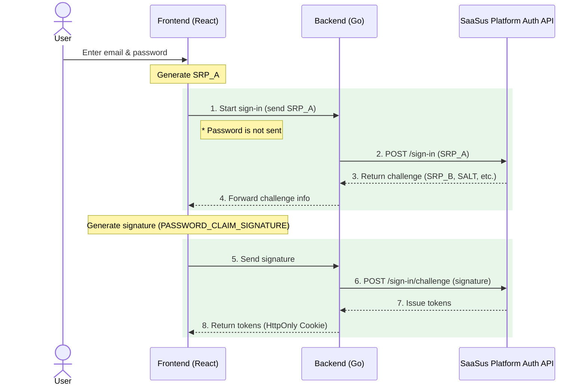

This document provides an overview of implementing login functionality using the SaaSus Platform Auth API with a custom login UI.

:::info
For concrete code in the basic implementation, see [Basic Implementation Using the Auth API](/docs/part-6/implementation-guide/auth/basic-sign-in). For an advanced example, see [Advanced Example Using the Auth API (ID Login)](/docs/part-6/implementation-guide/auth/advanced-sign-in). For security implementation, see [Authentication Security & Policy Implementation](/docs/part-6/implementation-guide/auth/security).
:::

## What is the Auth API?

The Auth API allows SaaS providers to implement login functionality from their own custom-built UI, without using the standard hosted login screen provided by SaaSus Platform.

By calling the SaaSus Platform Auth API (`/sign-in` and `/sign-in/challenge`) from the server side, you can obtain ID tokens, access tokens, and refresh tokens for subsequent API calls and authorization.

This document explains how to implement login functionality using a custom login UI with the Auth API.

## What You Can Do with the Auth API

### Email + Password Authentication from a Custom Login Screen

You can perform login from your own branded UI without using the SaaSus Platform standard login screen. The login screen design and UX can be customized.

### Token Acquisition (ID / Access / Refresh Tokens)

When authentication completes successfully, you can obtain the various tokens needed for SaaSus Platform API calls.

## Authentication Flow and Architecture

The Auth API is based on a **two-step authentication flow** using the Secure Remote Password (SRP) protocol. Instead of simply sending a password, it performs authentication securely through a challenge-and-response mechanism.

### Authentication Flow Overview

### Flow Details

1. **Start authentication**: Enter email (or ID) and password on the frontend, generate SRP_A, and send it to the backend (the password is not sent).
2. **Get challenge info**: The backend sends SRP_A to the SaaSus Platform Auth API's `/sign-in`.
3. **Receive challenge info**: The SaaSus Platform Auth API returns challenge info (SRP_B, SALT, SECRET_BLOCK, etc.) to the backend.
4. **Forward challenge info**: The backend returns the challenge info to the frontend.
5. **Generate and send signature**: The frontend generates the signature (`PASSWORD_CLAIM_SIGNATURE`, etc.) and sends it to the backend.
6. **Request verification**: The backend sends the signature and challenge info to the SaaSus Platform Auth API's `/sign-in/challenge`.
7. **Issue tokens**: On successful authentication, ID, access, and refresh tokens are returned to the backend.
8. **Save tokens**: The backend returns the tokens to the frontend in HttpOnly Cookies.

:::info Benefits of the SRP Protocol
The SRP (Secure Remote Password) protocol does not transmit the password itself in plain text over the network. Authentication is performed via hashing and SRP calculations, providing secure authentication even against man-in-the-middle attacks. Because completing SRP calculations entirely on the frontend is complex, this sample application generates SRP_A and signatures on the frontend while the backend mediates communication with the SaaSus Platform API.
:::

### Challenge Types and Branching

The challenges returned from the SaaSus Platform Auth API include:

| Challenge name | Description | Handling |
|---|---|---|
| `PASSWORD_VERIFIER` | Normal password verification | Send the challenge response and obtain tokens |
| `NEW_PASSWORD_REQUIRED` | Password change on first login | Prompt for new password and re-send the challenge |

## Sample Application Structure

The sample application for this implementation guide is published in the following repository.

- GitHub: [saasus-platform/implementation-sample-auth-api](https://github.com/saasus-platform/implementation-sample-auth-api)

The technology stack is as follows:

| Item | Stack |
|---|---|
| Frontend | React + TypeScript |
| Backend | Go |
| Token management | HttpOnly Cookie |
| Security | CSRF protection |

### Implemented Screens and Features

- **Login screen**: Tabbed UI with email login and ID login

- **New password screen**: Password change on first login
- **Auth API**: SRP authentication flow with the SaaSus Platform Auth API
- **ID login**: Login using username + tenant ID via the `login_domain` tenant attribute
- **Token management**: Secure token storage with HttpOnly Cookies
- **Sign-out**: Session termination by clearing cookies

For details on the implementation, see [Basic Implementation Using the Auth API](/docs/part-6/implementation-guide/auth/basic-sign-in).
