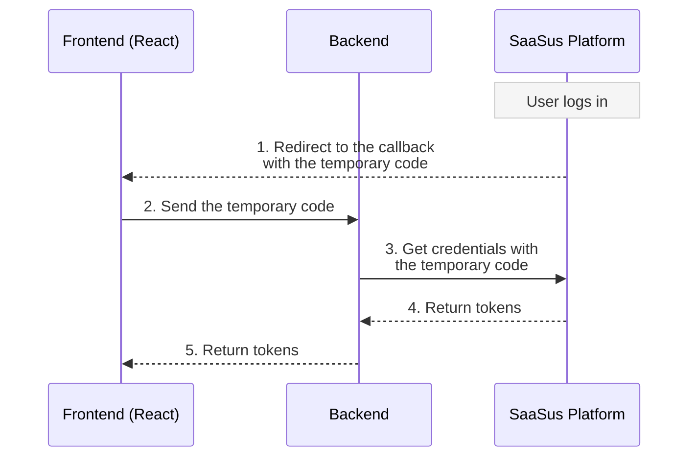
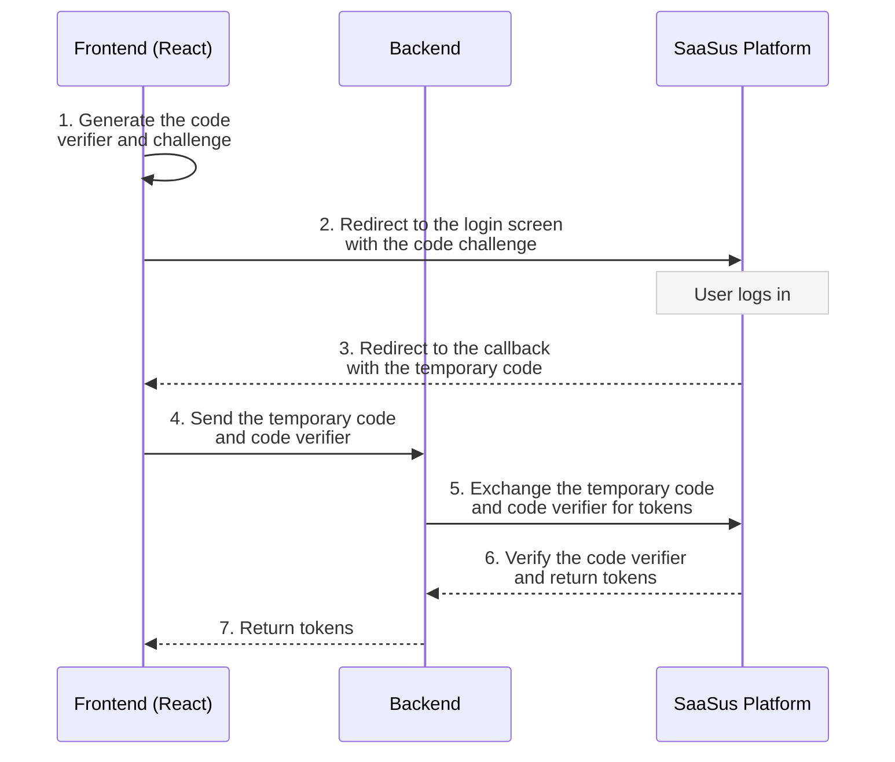

import Tabs from "@theme/Tabs";
import TabItem from "@theme/TabItem";

This page explains how to add PKCE-based login CSRF protection to the authentication flow when using the hosted login screen. Apply the changes described here to the authentication process of the current sample application to support PKCE.

:::info
This is an optional feature. The conventional flow continues to work without any changes, so you can adopt PKCE only when you need it.
:::

## Overview

When you use the hosted login screen, a temporary code is passed to the post-authentication redirect, and your application exchanges it for tokens. If a third party prepares a temporary code and has a victim exchange it, a login CSRF (authorization code injection) attack can succeed.

PKCE (Proof Key for Code Exchange) prevents this by binding the temporary code to the client that started the login. The application generates a verifier string (the code verifier) when starting the login, and sends only its hash (the code challenge) to the login screen. At the token exchange, it presents the code verifier, and SaaSus Platform verifies the pair. A temporary code issued for another session cannot be exchanged.

The conventional flow and the PKCE flow differ in these points.

- Conventional flow: obtains tokens from the temporary code alone.
- PKCE flow: sends the code challenge when starting the login, and presents the code verifier at the exchange.

## Process Flow Comparison

The conventional flow obtains tokens from the temporary code alone.



The PKCE flow adds a code challenge at login start and a code verifier at the exchange.



## Provide a Login Entry Point in Your Application

When using PKCE, start the login through an entry point that your application provides (for example, a path such as `/login`), and do not navigate directly to the SaaSus Platform login screen URL.

With PKCE, the application must generate and store a code verifier at the start of login, and pass only its hash (the code challenge) to the login screen. Because this generation and storage happen in your application code, opening the login screen URL directly leaves no stored code verifier, and the subsequent token exchange cannot complete.

Therefore, it is a good idea to route every path that starts a login—such as when the user is not logged in or has logged out—through your application's entry point, which generates and stores the code verifier before redirecting to the login screen, rather than linking to the login screen URL directly.

## Generating the Parameters

Generate the PKCE parameters as follows.

- Code verifier (`code_verifier`): Base64URL encoding of 32 random bytes (for example, a 43-character string).
- Code challenge (`code_challenge`): Base64URL encoding of the SHA-256 hash of the code verifier.
- Transformation method (`code_challenge_method`): S256.

Base64URL encoding does not use `+`, `/`, or `=`. Replace `+` with `-`, `/` with `_`, and remove trailing `=`.

:::info
The sample code referenced on this page is from the PKCE-enabled working branches (`feature/...`), and is not yet included in the `main` branch.
:::

## Frontend Implementation

### Login Entry Point (/login)

- [Login.tsx](https://github.com/saasus-platform/implementation-sample-front-react/blob/feature/pkce-dual-support/src/pages/Login.tsx)

This is the entry point for PKCE login. Accessing `/login` calls `redirectToLogin`, which generates and stores the code verifier, appends the code challenge, and then redirects to the SaaSus Platform login screen.

To try it with this sample application, open `http://localhost:3000/login` in your browser to start a PKCE login.

### Generating PKCE Parameters and Starting Login

- [pkce.ts](https://github.com/saasus-platform/implementation-sample-front-react/blob/feature/pkce-dual-support/src/pkce.ts)

This file groups the PKCE parameter generation and the redirect to the login screen. `redirectToLogin` generates a code verifier, stores it in session storage, appends the derived code challenge and the transformation method (S256) to the login URL, and redirects to the login screen. As described above, every path that starts a login (such as when the user is not logged in or has logged out) goes through `redirectToLogin` instead of navigating directly to the login URL.

### Post-authentication Redirect Screen (Callback)

- [Callback.tsx](https://github.com/saasus-platform/implementation-sample-front-react/blob/feature/pkce-dual-support/src/pages/Callback.tsx)

At the post-authentication redirect, it takes out the stored code verifier (`consumePkceCodeVerifier`) and sends it together with the temporary code to the backend (`POST /credentials`) to obtain tokens. If the temporary code or the code verifier is missing, it starts the login again. Only the token retrieval part changes; the subsequent processing, such as the screen navigation after obtaining tokens, can be used as is.

## Backend Implementation

The backend exchanges the temporary code and code verifier received from the frontend for tokens. In the sample, this is implemented in the handler of the endpoint that receives the request from the frontend (`POST /credentials`).

### Endpoint Summary

<div className="table-scroll">
  <table className="nowrap-table">
    <thead>
      <tr>
        <th>Type</th>
        <th>Method &amp; Path</th>
        <th>Description</th>
      </tr>
    </thead>
    <tbody>
      <tr>
        <td>Token exchange</td>
        <td><code>POST /credentials</code></td>
        <td>Receives the temporary code and code verifier from the frontend, exchanges them for tokens, and returns them.</td>
      </tr>
    </tbody>
  </table>
</div>

The implementation of the sample application endpoint (`POST /credentials`) is as follows.

<Tabs>
<TabItem value="go" label="Go" default>

```go
// Receives the temporary code (code) returned from the hosted login screen and the
// code_verifier generated and stored by the frontend, and exchanges them for tokens.
func exchangeCredentials(c echo.Context) error {
	var request struct {
		Code         string `json:"code"`
		CodeVerifier string `json:"code_verifier"`
	}
	if err := c.Bind(&request); err != nil || request.Code == "" || request.CodeVerifier == "" {
		return c.JSON(http.StatusBadRequest, echo.Map{"error": "invalid authentication request"})
	}

	// Specify the temporary code authentication flow and pass the temporary code and code verifier.
	code := authapi.Uuid(request.Code)
	body := authapi.ExchangeAuthCredentialsJSONRequestBody{
		AuthFlow:     authapi.ExchangeAuthCredentialsParamAuthFlowTempCodeAuth,
		Code:         &code,
		CodeVerifier: &request.CodeVerifier,
	}

	res, err := authClient.ExchangeAuthCredentialsWithResponse(c.Request().Context(), body)
	if err != nil {
		c.Logger().Errorf("failed to exchange credentials: %v", err)
		return c.String(http.StatusInternalServerError, "internal server error")
	}
	// Return 401 (such as a PKCE verification failure) to the frontend as is to show an error.
	if res.JSON401 != nil {
		return c.JSON(http.StatusUnauthorized, res.JSON401)
	}
	if res.JSON404 != nil {
		return c.JSON(http.StatusNotFound, res.JSON404)
	}
	if res.JSON200 == nil {
		c.Logger().Errorf("failed to exchange credentials: %s", res.Body)
		return c.String(http.StatusInternalServerError, "internal server error")
	}

	return c.JSON(http.StatusOK, res.JSON200)
}
```

</TabItem>
</Tabs>

#### Implementation Links

The implementation of this endpoint is included in the following link.  
Search for the function name to find the relevant part.

- **Go (Echo)**: [`exchangeCredentials`](https://github.com/saasus-platform/implementation-sample-api-go/blob/feature/pkce-hosted-login/main.go)
- **Other languages**: in preparation
