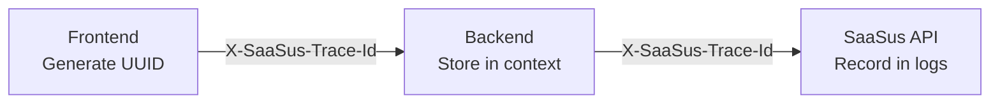

import Tabs from "@theme/Tabs";
import TabItem from "@theme/TabItem";

## Overview

In SaaS applications, a single user action can trigger multiple API requests. For example, simply displaying the admin dashboard may invoke several SaaSus APIs for authentication, user information retrieval, and MFA status checks.

By using Trace ID (`X-SaaSus-Trace-Id`), you can assign a common ID to these related API requests, enabling you to trace and analyze logs collectively afterward.

## Architecture



:::tip Key Point
Once you set the Trace ID in the context on the backend, the SDK automatically propagates `X-SaaSus-Trace-Id` to all SaaSus API requests. There's no need to manually set the header for each API call in your application.
:::

## Implementation

### Frontend: Generating and Attaching Trace ID

Generate a UUID on the frontend and attach it to the request header as `X-SaaSus-Trace-Id` when making requests to the backend.

<Tabs>
<TabItem value="typescript" label="TypeScript" default>

```typescript
// Generate UUID
const traceId = crypto.randomUUID();

// Attach to backend request
await fetch('/api/endpoint', {
  headers: {
    'Authorization': `Bearer ${jwtToken}`,
    'X-SaaSus-Trace-Id': traceId
  }
});
```

</TabItem>
</Tabs>

:::info Trace ID Granularity
Determine when to generate Trace IDs based on the granularity you want to analyze—per page navigation, per user action, etc. By sharing the same `trace_id` across multiple requests, you can group a series of operations together.
:::

### Backend: Storing in Context via Middleware

#### Using Standard net/http (with SDK-provided Middleware)

You can directly use `middleware.ExtractTraceId` provided by the SDK.

<Tabs>
<TabItem value="go" label="Go" default>

```go
import (
    "github.com/saasus-platform/saasus-sdk-go/middleware"
)

// Use SDK-provided middleware
mux := http.NewServeMux()
handler := middleware.ExtractTraceId(mux)
http.ListenAndServe(":8080", handler)
```

</TabItem>
</Tabs>

#### Using Frameworks like Echo

Implement context storage processing according to your framework's middleware format.

<Tabs>
<TabItem value="go" label="Go" default>

```go
import (
    "context"

    "github.com/labstack/echo/v4"
    "github.com/saasus-platform/saasus-sdk-go/ctxlib"
)

// Custom middleware implementation example
func SaaSusTraceIDMiddleware() echo.MiddlewareFunc {
    return func(next echo.HandlerFunc) echo.HandlerFunc {
        return func(c echo.Context) error {
            traceID := c.Request().Header.Get("X-SaaSus-Trace-Id")
            if traceID != "" {
                ctx := context.WithValue(c.Request().Context(), ctxlib.XSaaSusTraceIDKey, traceID)
                c.SetRequest(c.Request().WithContext(ctx))
            }
            return next(c)
        }
    }
}
```

</TabItem>
</Tabs>

Registering with Echo server:

<Tabs>
<TabItem value="go" label="Go" default>

```go
e := echo.New()
e.Use(SaaSusTraceIDMiddleware())
```

</TabItem>
</Tabs>

### Automatic Propagation within SDK (No Implementation Required)

Within the SDK, `client.SetTraceID()` is called in the `RequestEditorFn` of each module (auth, pricing, billing, etc.). If `XSaaSusTraceIdKey` is stored in the context, `X-SaaSus-Trace-Id` is automatically added to the request headers for SaaSus API calls.

:::note Note
`SetTraceID()` is provided as a separate function from `SetReferer()`. Referer propagation and Trace ID propagation each have their own single responsibility.
:::

## Viewing and Analyzing Logs

When Trace ID is propagated, it is recorded as a `trace_id` field in the SaaSus Platform API logs.

### Viewing in the SaaS Development Console

From the "API Log" in the SaaS Development Console, you can filter by `trace_id` to display a list of related API requests.

### Retrieving and Analyzing API Logs

You can also programmatically retrieve logs from the SaaSus API and filter by `trace_id`.

#### Log Response Example

With the same `trace_id: 3564e3c3-...`, you can confirm that 3 API calls are linked to a single user operation.

| Timestamp | API Path | Trace ID |
|:---|:---|:---|
| 2024-05-01 10:00:01 | /auth/credentials | 3564e3c3-... |
| 2024-05-01 10:00:02 | /auth/mfa | 3564e3c3-... |
| 2024-05-01 10:00:03 | /auth/mfa/secret | 3564e3c3-... |

## Analysis Use Cases

| Use Case | Method |
|:---|:---|
| Identifying Error Causes | Search by the `trace_id` of the request where the error occurred, and check preceding requests and related API calls |
| Analyzing User Flows | Arrange logs with the same `trace_id` chronologically to visualize what operation flow the user followed |
| Performance Investigation | Compare `created_at` of requests within the same `trace_id` to identify which processes took how long |

## Summary

| Implementation Area | Required Work |
|:---|:---|
| Frontend | Generate UUID and attach to `X-SaaSus-Trace-Id` header |
| Backend | Store header in context via middleware (choose SDK standard or framework-specific) |
| SDK → SaaSus API | Automatic (no implementation required). `SetTraceID()` retrieves from context and propagates |
| Log Analysis | Filter by `trace_id` in the API Log of the SaaS Development Console or via the API |

## Reference Links

- [Activity History Log Implementation](./activity-history-log)
- [SaaSus SDK Go Repository](https://github.com/saasus-platform/saasus-sdk-go)
