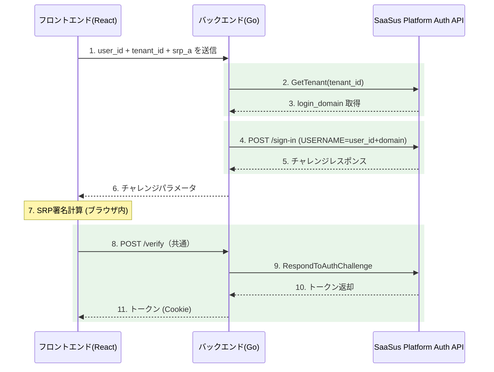

メールアドレスの代わりに、**ユーザー名＋テナントID** でログインするID認証方式の実装方法を解説します。

IDログインは単独で実装することも、メールアドレスログインと併用することもできます。SRP認証の計算処理やトークン検証（`POST /verify`）の仕組みはメールアドレスログインと同じで、チャレンジリクエストのエンドポイントとパラメータのみが異なります。

:::info
基本のメールアドレスログインの実装については [認証APIを利用した基本実装](/docs/part-6/implementation-guide/auth/basic-sign-in) を、認証APIの全体像については [認証API実装ガイド](/docs/part-6/implementation-guide/auth/overview) をご参照ください。
:::

## 概要

IDログインでは、SaaSus Platform のテナント属性に設定された `login_domain` を利用します。バックエンドがテナント情報を取得し、`ユーザー名 + login_domain`（例: `taro` + `@example.com` = `taro@example.com`）を結合して SaaSus Platform Auth API に送信します。

これにより、ユーザーはメールアドレス全体を覚えていなくても、ユーザー名とテナントIDだけでログインできるようになります。複数テナントを運用する SaaS において、テナントごとに完結したログイン体験を提供したい場合に有効です。

## 前提条件

IDログインを実装するためには、以下の前提条件をすべて満たしている必要があります。

### 1. SaaSus Platform 側の設定

#### テナント属性 `login_domain` が定義されていること

SaaS運用コンソールの「テナント属性」設定で、`login_domain` という名前のテナント属性を追加してください。

- **属性名**: `login_domain`
- **属性タイプ**: 文字列（string）
- **値の形式**: `@` を含むドメイン部分（例: `@example.com`、`@tenant1.example.com`）

:::tip 値の形式について
`login_domain` には**メールアドレスの `@` 以降を含む形式**で設定します（例: `@example.com`）。これにより `user_id` と単純結合した際に有効なメールアドレス形式になります。`@` を含まないドメイン名のみで設定すると、結合時に正しいメールアドレスにならず認証に失敗します。
:::

#### 対象テナントに `login_domain` の値が設定されていること

ログイン対象となるテナントごとに、上記で定義した `login_domain` 属性に値が設定されている必要があります。値が未設定のテナントに対しては、IDログイン処理が失敗します。

#### ユーザーが `ユーザー名 + login_domain` の形式で SaaSus Platform に登録されていること

たとえば `login_domain` が `@example.com` のテナントで `taro` というID名でログインさせたい場合、SaaSus Platform 側のユーザーは `taro@example.com` というメールアドレスで登録されている必要があります。

### 2. アプリケーション側の前提

#### メールアドレスログインの基本実装が完了していること

IDログインは、基本のメールアドレスログイン（`POST /sign-in` および `POST /sign-in/challenge`）の仕組みの上に成り立ちます。先に [認証APIを利用した基本実装](/docs/part-6/implementation-guide/auth/basic-sign-in) を完了させた状態が前提です。

具体的には、以下が動作している必要があります：

- フロントエンドからの SRP_A 生成と送信
- バックエンドの `POST /sign-in` エンドポイント
- SRP 署名計算とトークン取得（`POST /verify` または `POST /sign-in/challenge`）
- HttpOnly Cookie によるトークン管理

#### テナント情報を取得する権限を持つ API キーが設定されていること

バックエンドから SaaSus Platform Auth API の `GetTenant` を呼び出すため、テナント情報の参照権限を持つ API キーがアプリケーションに設定されている必要があります。

### 3. UI 上の前提

#### ユーザーがテナントIDを把握できる手段があること

IDログインではユーザーがテナントIDを入力する必要があるため、以下のいずれかの方法でテナントIDをユーザーに提示する必要があります：

- テナント固有のログインURLを配布する（例: `https://app.example.com/login?tenant_id=xxx`）
- ログイン画面でテナントIDの入力欄を設ける
- ログイン前のテナント選択画面を設ける

本サンプルアプリケーションでは、URLクエリパラメータ `?tenant_id=xxx` での事前指定と、フォームでの直接入力の両方をサポートしています。

## フロントエンド

### 入力項目

IDログインでは、フロントエンドで以下の入力を受け付けます：

- **ユーザー名**: メールアドレスの `@` より前の部分（例: `taro`）
- **テナントID**: ログイン対象のテナントID
- **パスワード**: ユーザーのパスワード（SRP計算にのみ使用し、サーバーには送信しない）

テナントIDは、URLクエリパラメータ `?tenant_id=xxx` で事前に指定することもできます。これにより、テナント固有のログインURLを配布するといった運用が可能です。

### チャレンジリクエスト

IDログインでは、メールアドレスログインの `/challenge` の代わりに `/challenge-id` エンドポイントを呼び出します。

```typescript
// IDログイン時のチャレンジリクエスト
const challengeResponse = await apiClient.post('/challenge-id', {
  user_id: userId,
  tenant_id: tenantId,
  srp_a: srpA,
});
```

チャレンジ取得以降の処理（SRP署名計算、`POST /verify` によるトークン取得）はメールアドレスログインと同じです。

## バックエンド

### POST /challenge-id エンドポイント

ID認証用のチャレンジエンドポイントです。メールアドレスの代わりに `user_id` と `tenant_id` を受け取ります。

#### リクエスト構造体

```go
// ChallengeIdRequest はID認証用チャレンジリクエストの構造体
type ChallengeIdRequest struct {
	UserID   string `json:"user_id" binding:"required"`
	TenantID string `json:"tenant_id" binding:"required"`
	SrpA     string `json:"srp_a" binding:"required"`
}
```

#### 処理の流れ

1. リクエストボディから `user_id`、`tenant_id`、`srp_a` を取得
2. **テナント情報を取得**: SaaSus Platform Auth API でテナント情報を取得し、テナント属性から `login_domain` を読み取る
3. **USERNAME を構成**: `user_id + login_domain` を結合（例: `taro` + `@example.com` = `taro@example.com`）
4. SaaSus Platform Auth API の `/sign-in` を呼び出し、SRP認証を開始
5. チャレンジパラメータをフロントエンドに返却

```go
func challengeId(c echo.Context) error {
	var req ChallengeIdRequest
	if err := c.Bind(&req); err != nil {
		return c.JSON(http.StatusBadRequest, ChallengeResponse{
			Success: false,
			Message: "Invalid request format",
		})
	}

	ctx := context.Background()

	// テナント情報を取得してlogin_domain属性を読み取る
	tenantResponse, err := authClient.GetTenantWithResponse(ctx, req.TenantID)
	if err != nil || tenantResponse.JSON200 == nil {
		return c.JSON(http.StatusBadRequest, ChallengeResponse{
			Success: false,
			Message: "Tenant not found",
		})
	}

	// テナント属性からlogin_domainを取得
	tenant := tenantResponse.JSON200
	loginDomain := ""
	if tenant.Attributes != nil {
		if domain, ok := tenant.Attributes["login_domain"]; ok {
			if domainStr, ok := domain.(string); ok {
				loginDomain = domainStr
			}
		}
	}

	if loginDomain == "" {
		return c.JSON(http.StatusBadRequest, ChallengeResponse{
			Success: false,
			Message: "Tenant does not have login_domain attribute configured",
		})
	}

	// user_id + login_domain でUSERNAMEを構成
	// 例: "taro" + "@example.com" = "taro@example.com"
	username := req.UserID + loginDomain

	// SaaSus Platform Auth API にSignInリクエストを送信
	signInParam := authapi.SignInParam{
		SignInFlow: authapi.USERSRPAUTH,
		SignInParameters: &map[string]string{
			"USERNAME": username,
			"SRP_A":    req.SrpA,
		},
	}

	signInResponse, err := authClient.SignInWithResponse(ctx, signInParam)
	if err != nil || signInResponse.JSON200 == nil {
		return c.JSON(http.StatusInternalServerError, ChallengeResponse{
			Success: false,
			Message: "SignIn challenge failed",
		})
	}

	// チャレンジパラメータを返却（以降はメールアドレスログインと同じverifyフロー）
	signInResult := signInResponse.JSON200
	challengeParameters := *signInResult.ChallengeParameters

	session := ""
	if signInResult.Session != nil {
		session = *signInResult.Session
	}

	return c.JSON(http.StatusOK, ChallengeResponse{
		Success:     true,
		Message:     "Challenge parameters retrieved",
		SrpB:        challengeParameters["SRP_B"],
		Salt:        challengeParameters["SALT"],
		SecretBlock: challengeParameters["SECRET_BLOCK"],
		PoolName:    challengeParameters["POOL_NAME"],
		Username:    challengeParameters["USER_ID_FOR_SRP"],
		Session:     session,
	})
}
```

## IDログインの処理フロー



メールアドレスログインとの主な差分は **ステップ2〜4** です。テナント情報から `login_domain` を取得し、`user_id` と結合して USERNAME を構成する処理が追加されています。ステップ7以降の SRP 署名計算とトークン取得（`POST /verify`）は共通です。
