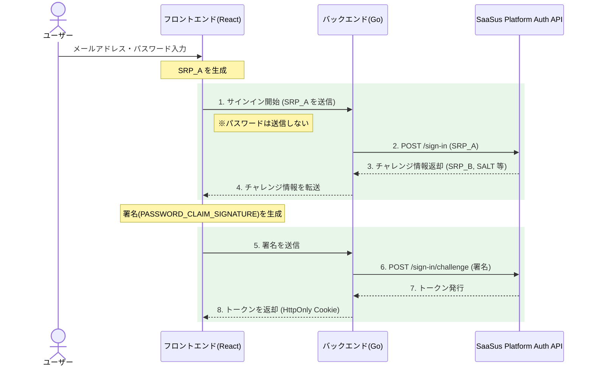

SaaSus Platform ログインAPIを使って、独自のログイン画面からログイン処理を実装するための概要を説明します。

:::info
サンプルコードの具体的な実装内容については、[ログイン処理の実装](/docs/part-6/implementation-guide/auth/sign-in)をご参照ください。
:::

## ログインAPIとは

ログインAPIは、SaaSus Platform が提供する標準のホステッドログイン画面を使用せず、SaaS プロバイダーが独自に構築した UI からログイン機能を実装するための API です。

サーバーサイドから SaaSus Platform Auth API（`/sign-in` および `/sign-in/challenge`）を呼び出すことで、ID トークン・アクセストークン・リフレッシュトークンを取得でき、以降の API 呼び出しや認可に利用します。

本ドキュメントでは、このログインAPIを使って「独自ログイン画面」を使った、ログイン処理を実装する方法を説明します。

## ログインAPIでできること

### 独自ログイン画面からのメールアドレス＋パスワード認証

SaaSus Platform 標準ログイン画面を利用せず、自社ブランドの UI からログイン処理を行えます。ログイン画面のデザインやUXをカスタマイズできます。

### トークン（ID／アクセス／リフレッシュトークン）の取得

正常に認証が完了すると、SaaSus Platform API 呼び出しに必要な各種トークンが取得できます。

## 認証フローとアーキテクチャ

ログインAPIは、Secure Remote Password（SRP）プロトコルに基づいた **2段階認証フロー** です。単にパスワードを送信するのではなく、チャレンジ＆レスポンス方式で安全に認証を行います。

### 認証フロー概要

### フローの詳細

1. **認証開始**: フロントエンドでメールアドレス（または ID）とパスワードを入力し、SRP_A を生成してバックエンドに送信します（パスワードは送信しません）。
2. **チャレンジ情報取得**: バックエンドが SRP_A を SaaSus Platform Auth API の `/sign-in` に送信します。
3. **チャレンジ情報受信**: SaaSus Platform Auth API からチャレンジ情報（SRP_B, SALT, SECRET_BLOCK など）がバックエンドに返されます。
4. **チャレンジ情報転送**: バックエンドがチャレンジ情報をフロントエンドに返却します。
5. **署名生成と送信**: フロントエンドが署名（`PASSWORD_CLAIM_SIGNATURE` など）を生成し、バックエンドに送信します。
6. **検証の依頼**: バックエンドが署名とチャレンジ情報を SaaSus Platform Auth API の `/sign-in/challenge` に送信します。
7. **トークン発行**: 認証成功時、ID トークン・アクセストークン・リフレッシュトークンがバックエンドに返却されます。
8. **トークン保存**: バックエンドが HttpOnly Cookie でトークンをフロントエンドに返します。

:::info SRP プロトコルのメリット
SRP（Secure Remote Password）プロトコルでは、パスワードそのものをネットワーク上に平文で送信しません。ハッシュ化や SRP 計算を通じて認証を行うため、中間者攻撃に対してもセキュアな認証が実現できます。フロントエンドだけで SRP 計算を完結させるのは複雑なため、本サンプルアプリケーションでは、フロントエンドで SRP_A や署名の生成を行い、バックエンドが SaaSus Platform API との通信を仲介する構成をとっています。
:::

### チャレンジの種類と分岐処理

SaaSus Platform Auth API から返されるチャレンジには、以下の種類があります：

| チャレンジ名 | 説明 | 処理 |
|---|---|---|
| `PASSWORD_VERIFIER` | 通常のパスワード検証 | チャレンジレスポンスを送信してトークンを取得 |
| `NEW_PASSWORD_REQUIRED` | 初回ログイン時のパスワード変更 | 新しいパスワードの入力を求め、再度チャレンジを送信 |

## サンプルアプリケーションの構成

本実装ガイドのサンプルアプリケーションは、以下の構成で実装されています：

| 項目 | 技術スタック |
|---|---|
| フロントエンド | React + TypeScript |
| バックエンド | Go |
| トークン管理 | HttpOnly Cookie |
| セキュリティ | CSRF 対策 |

### 実装されている画面・機能

- **ログイン画面**: メールアドレスログインとIDログインのタブ切り替えUI
- **新パスワード設定画面**: 初回ログイン時のパスワード変更
- **ログインAPI**: SaaSus Platform Auth API との SRP 認証フロー
- **IDログイン**: テナント属性 `login_domain` を活用したユーザー名＋テナントIDによるログイン
- **トークン管理**: HttpOnly Cookie による安全なトークン保存
- **ログアウト処理**: Cookie クリアによるセッション終了

具体的な実装内容は、[ログイン処理の実装](/docs/part-6/implementation-guide/auth/sign-in)をご覧ください。
