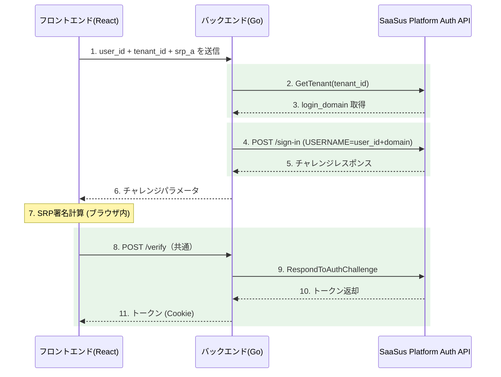

認証APIサンプルアプリケーションを題材に、独自ログイン画面からのログイン処理の実装方法を解説します。

:::info
認証APIの概要やフローについては、[認証API実装ガイド概要](/docs/part-6/implementation-guide/auth/overview)をご参照ください。
:::

## フロントエンド実装

### ログイン画面コンポーネント

ログイン画面では、以下の要素を実装します：

- **メールアドレス（または ID）入力フィールド**: ユーザーの識別子を入力
- **パスワード入力フィールド**: ユーザーのパスワードを入力
- **ログインボタン**: ログイン処理を開始
- **エラーメッセージ表示領域**: 認証エラー時のメッセージを表示

<!-- TODO: ログイン画面のスクリーンショットを追加 -->

### ログイン処理のフロー

フロントエンドのログイン処理は、以下の流れで実装します：

#### 1. ログイン開始

ユーザーが入力したメールアドレス（または ID）とパスワードを、バックエンドの `POST /sign-in` エンドポイントに送信します。

```typescript
// ログインフォームの送信処理
const handleLogin = async (identifier: string, password: string) => {
  try {
    const response = await fetch("/sign-in", {
      method: "POST",
      headers: { "Content-Type": "application/json" },
      body: JSON.stringify({ identifier, password }),
    });

    const data = await response.json();

    if (data.challenge_name) {
      // チャレンジが返された場合、次のステップへ
      await handleChallenge(data);
    }
  } catch (error) {
    setErrorMessage("ログインに失敗しました");
  }
};
```

#### 2. チャレンジレスポンスの処理

バックエンドから返されたチャレンジパラメータを使って、チャレンジレスポンスをバックエンドの `POST /sign-in/challenge` に送信します。

```typescript
const handleChallenge = async (challengeData: ChallengeResponse) => {
  if (challengeData.challenge_name === "NEW_PASSWORD_REQUIRED") {
    // 初回ログイン時: 新パスワード設定画面へ遷移
    navigateToNewPasswordPage(challengeData);
    return;
  }

  // PASSWORD_VERIFIER の場合: チャレンジレスポンスを送信
  const response = await fetch("/sign-in/challenge", {
    method: "POST",
    headers: { "Content-Type": "application/json" },
    body: JSON.stringify({
      challenge_name: challengeData.challenge_name,
      // バックエンドから受け取ったチャレンジパラメータをそのまま送信
      ...challengeData.challenge_parameters,
    }),
  });

  if (response.ok) {
    // ログイン成功: トークンは HttpOnly Cookie に自動保存される
    navigateToMainPage();
  }
};
```

#### 3. 新パスワード設定（初回ログイン時）

`NEW_PASSWORD_REQUIRED` チャレンジが返された場合、ユーザーに新しいパスワードの入力を求め、バックエンドに送信します。

```typescript
const handleNewPassword = async (
  newPassword: string,
  session: string
) => {
  const response = await fetch("/sign-in/challenge", {
    method: "POST",
    headers: { "Content-Type": "application/json" },
    body: JSON.stringify({
      challenge_name: "NEW_PASSWORD_REQUIRED",
      new_password: newPassword,
      session: session,
    }),
  });

  if (response.ok) {
    // パスワード変更成功後、メイン画面へ遷移
    navigateToMainPage();
  }
};
```

#### 4. ログイン後の画面遷移

トークンの保存が完了したら、メイン画面（ユーザー一覧画面など）に遷移します。トークンは HttpOnly Cookie に保存されるため、フロントエンドで直接トークンを操作する必要はありません。

## バックエンド実装

バックエンドでは、フロントエンドからのリクエストを受け取り、SaaSus Platform Auth API と通信してログイン処理を行います。

### POST /sign-in エンドポイント

フロントエンドから受け取ったメールアドレス（または ID）とパスワードを使って、SaaSus Platform Auth API の `/sign-in` を呼び出します。

#### 処理の流れ

1. リクエストボディからメールアドレス（または ID）とパスワードを取得
2. **ID/メールアドレス変換**: 入力値に `@` が含まれていない場合、ダミードメインを付与してメールアドレス形式に変換
3. SRP_A を計算して SaaSus Platform Auth API の `/sign-in` を呼び出し
4. チャレンジレスポンス（`PASSWORD_VERIFIER` 等）をフロントエンドに返却

```go
// POST /sign-in ハンドラ
func signIn(c echo.Context) error {
    var req SignInRequest
    if err := c.Bind(&req); err != nil {
        return c.JSON(http.StatusBadRequest, map[string]string{"error": "invalid request"})
    }

    // ID/メールアドレスの変換処理
    email := req.Identifier
    if !strings.Contains(req.Identifier, "@") {
        // ID形式の場合、ダミードメインを付与
        email = req.Identifier + "@example.auth"
    }

    // SaaSus Platform Auth API の /sign-in を呼び出し
    // SRP_A の計算と送信を行う
    resp, err := authClient.SignIn(email, req.Password)
    if err != nil {
        return c.JSON(http.StatusUnauthorized, map[string]string{"error": "authentication failed"})
    }

    // チャレンジパラメータをフロントエンドに返却
    return c.JSON(http.StatusOK, resp)
}
```

:::tip ID 変換のポイント
ID 形式でのログインを利用する場合、このダミードメインは SaaSus Platform にユーザーを登録する際に使用したドメインと一致させてください。環境変数などで管理するのが推奨です。
:::

### POST /sign-in/challenge エンドポイント

フロントエンドから受け取ったチャレンジレスポンスを使って、SaaSus Platform Auth API の `/sign-in/challenge` を呼び出します。チャレンジの種類に応じて処理を分岐します。

#### PASSWORD_VERIFIER の場合

通常のパスワード検証フローです。チャレンジレスポンスを送信してトークンを取得します。

```go
// POST /sign-in/challenge ハンドラ
func signInChallenge(c echo.Context) error {
    var req ChallengeRequest
    if err := c.Bind(&req); err != nil {
        return c.JSON(http.StatusBadRequest, map[string]string{"error": "invalid request"})
    }

    // SaaSus Platform Auth API の /sign-in/challenge を呼び出し
    resp, err := authClient.RespondToChallenge(req)
    if err != nil {
        return c.JSON(http.StatusUnauthorized, map[string]string{"error": "challenge failed"})
    }

    switch resp.ChallengeName {
    case "":
        // 認証完了: トークンを HttpOnly Cookie にセット
        setTokenCookies(c, resp.Tokens)
        return c.JSON(http.StatusOK, map[string]string{"status": "authenticated"})

    case "NEW_PASSWORD_REQUIRED":
        // 初回ログイン: 新パスワード設定が必要
        return c.JSON(http.StatusOK, map[string]interface{}{
            "challenge_name":       "NEW_PASSWORD_REQUIRED",
            "session":              resp.Session,
            "challenge_parameters": resp.ChallengeParameters,
        })

    default:
        return c.JSON(http.StatusBadRequest, map[string]string{"error": "unsupported challenge"})
    }
}
```

#### NEW_PASSWORD_REQUIRED の場合

初回ログイン時にパスワード変更が求められるケースです。新しいパスワードを受け取り、SaaSus Platform Auth API に送信します。

```go
// 新パスワード設定処理
// challenge_name が NEW_PASSWORD_REQUIRED の場合に呼ばれる
func handleNewPasswordRequired(c echo.Context, req ChallengeRequest) error {
    // SaaSus Platform Auth API に新パスワードを送信
    resp, err := authClient.RespondToNewPasswordChallenge(
        req.Session,
        req.NewPassword,
    )
    if err != nil {
        return c.JSON(http.StatusBadRequest, map[string]string{"error": "password change failed"})
    }

    // パスワード変更成功後、トークンを HttpOnly Cookie にセット
    setTokenCookies(c, resp.Tokens)
    return c.JSON(http.StatusOK, map[string]string{"status": "authenticated"})
}
```

:::caution ID ログイン時の注意
`NEW_PASSWORD_REQUIRED` のフローでも、ID 形式でログインしたユーザーの場合はダミードメインを付与したメールアドレスを正しく扱う必要があります。ログイン開始時に変換した値をセッション等で保持しておくことを推奨します。
:::

## セキュリティ対応

### HttpOnly Cookie によるトークン管理

取得したトークンは、**HttpOnly Cookie** に保存します。ローカルストレージに保存する方法と比較して、XSS（クロスサイトスクリプティング）攻撃によるトークン窃取のリスクを低減できます。

```go
// トークンを HttpOnly Cookie にセットする関数
func setTokenCookies(c echo.Context, tokens Tokens) {
    // アクセストークン
    c.SetCookie(&http.Cookie{
        Name:     "access_token",
        Value:    tokens.AccessToken,
        Path:     "/",
        HttpOnly: true,
        Secure:   true, // HTTPS 環境では必ず true
        SameSite: http.SameSiteStrictMode,
        MaxAge:   3600, // 1時間
    })

    // リフレッシュトークン
    c.SetCookie(&http.Cookie{
        Name:     "refresh_token",
        Value:    tokens.RefreshToken,
        Path:     "/",
        HttpOnly: true,
        Secure:   true,
        SameSite: http.SameSiteStrictMode,
        MaxAge:   86400 * 30, // 30日
    })

    // ID トークン
    c.SetCookie(&http.Cookie{
        Name:     "id_token",
        Value:    tokens.IDToken,
        Path:     "/",
        HttpOnly: true,
        Secure:   true,
        SameSite: http.SameSiteStrictMode,
        MaxAge:   3600, // 1時間
    })
}
```

#### Cookie 属性の設定ポイント

| 属性 | 設定値 | 説明 |
|---|---|---|
| `HttpOnly` | `true` | JavaScript からのアクセスを禁止し、XSS 攻撃からトークンを保護 |
| `Secure` | `true` | HTTPS 接続時のみ Cookie を送信（本番環境では必須） |
| `SameSite` | `Strict` | クロスサイトリクエストでの Cookie 送信を防止 |
| `Path` | `/` | アプリケーション全体で Cookie を利用可能に |

:::info 開発環境での注意
ローカル開発環境（`http://localhost`）では、`Secure` 属性を `false` に設定する必要がある場合があります。環境変数で切り替えられるようにしておくことを推奨します。
:::

### CSRF 対策

HttpOnly Cookie を使用する場合、CSRF（クロスサイトリクエストフォージェリ）対策が必要です。本サンプルでは、以下の対策を組み合わせて実装しています：

1. **SameSite Cookie 属性**: `SameSite=Strict` を設定し、クロスサイトからの Cookie 送信を防止
2. **CSRF トークン**: サーバー側で生成した CSRF トークンをフロントエンドに渡し、リクエスト時にヘッダーに含めて検証

```go
// CSRF ミドルウェアの設定例
e.Use(middleware.CSRFWithConfig(middleware.CSRFConfig{
    TokenLookup: "header:X-CSRF-Token",
    CookiePath:  "/",
}))
```

### ログアウト処理

ログアウト時は、HttpOnly Cookie に保存したすべてのトークンをクリアします。

```go
// POST /sign-out ハンドラ
func signOut(c echo.Context) error {
    // 各トークンの Cookie を削除（MaxAge を -1 に設定）
    for _, name := range []string{"access_token", "refresh_token", "id_token"} {
        c.SetCookie(&http.Cookie{
            Name:     name,
            Value:    "",
            Path:     "/",
            HttpOnly: true,
            Secure:   true,
            SameSite: http.SameSiteStrictMode,
            MaxAge:   -1, // Cookie を即座に削除
        })
    }

    return c.JSON(http.StatusOK, map[string]string{"status": "signed_out"})
}
```

フロントエンドからのログアウト呼び出し：

```typescript
const handleLogout = async () => {
  await fetch("/sign-out", { method: "POST" });
  // ログイン画面へ遷移
  navigateToLoginPage();
};
```

## IDログイン方式の拡張

メールアドレスの代わりに、**ユーザー名＋テナントID** でログインするID認証方式を実装できます。

IDログインは単独で実装することも、メールアドレスログインと併用することもできます。SRP認証の計算処理やトークン検証（`POST /verify`）の仕組みはメールアドレスログインと同じで、チャレンジリクエストのエンドポイントとパラメータのみが異なります。

### 概要と前提条件

IDログインでは、SaaSus Platform のテナント属性に設定された `login_domain` を利用します。バックエンドがテナント情報を取得し、`ユーザー名 + login_domain`（例: `taro` + `@example.com` = `taro@example.com`）を結合して SaaSus Platform Auth API に送信します。

#### 前提条件

- SaaS運用コンソールでテナント属性 `login_domain` を定義済みであること（例: `@example.com`）
- 対象テナントに `login_domain` の値が設定済みであること
- ユーザーが `ユーザー名 + login_domain` の形式でSaaSus Platformに登録済みであること

### フロントエンドの入力項目

IDログインでは、フロントエンドで以下の入力を受け付けます：

- **ユーザー名**: メールアドレスの `@` より前の部分（例: `taro`）
- **テナントID**: ログイン対象のテナントID
- **パスワード**: ユーザーのパスワード（SRP計算にのみ使用し、サーバーには送信しない）

テナントIDは、URLクエリパラメータ `?tenant_id=xxx` で事前に指定することもできます。これにより、テナント固有のログインURLを配布するといった運用が可能です。

### チャレンジリクエスト

IDログインでは、メールアドレスログインの `/challenge` の代わりに `/challenge-id` エンドポイントを呼び出します。

```typescript
// IDログイン時のチャレンジリクエスト
const challengeResponse = await apiClient.post('/challenge-id', {
  user_id: userId,
  tenant_id: tenantId,
  srp_a: srpA,
});
```

チャレンジ取得以降の処理（SRP署名計算、`POST /verify` によるトークン取得）はメールアドレスログインと同じです。

### POST /challenge-id エンドポイント

ID認証用のチャレンジエンドポイントです。メールアドレスの代わりに `user_id` と `tenant_id` を受け取ります。

#### リクエスト構造体

```go
// ChallengeIdRequest はID認証用チャレンジリクエストの構造体
type ChallengeIdRequest struct {
	UserID   string `json:"user_id" binding:"required"`
	TenantID string `json:"tenant_id" binding:"required"`
	SrpA     string `json:"srp_a" binding:"required"`
}
```

#### 処理の流れ

1. リクエストボディから `user_id`、`tenant_id`、`srp_a` を取得
2. **テナント情報を取得**: SaaSus Platform Auth API でテナント情報を取得し、テナント属性から `login_domain` を読み取る
3. **USERNAME を構成**: `user_id + login_domain` を結合（例: `taro` + `@example.com` = `taro@example.com`）
4. SaaSus Platform Auth API の `/sign-in` を呼び出し、SRP認証を開始
5. チャレンジパラメータをフロントエンドに返却

```go
func challengeId(c echo.Context) error {
	var req ChallengeIdRequest
	if err := c.Bind(&req); err != nil {
		return c.JSON(http.StatusBadRequest, ChallengeResponse{
			Success: false,
			Message: "Invalid request format",
		})
	}

	ctx := context.Background()

	// テナント情報を取得してlogin_domain属性を読み取る
	tenantResponse, err := authClient.GetTenantWithResponse(ctx, req.TenantID)
	if err != nil || tenantResponse.JSON200 == nil {
		return c.JSON(http.StatusBadRequest, ChallengeResponse{
			Success: false,
			Message: "Tenant not found",
		})
	}

	// テナント属性からlogin_domainを取得
	tenant := tenantResponse.JSON200
	loginDomain := ""
	if tenant.Attributes != nil {
		if domain, ok := tenant.Attributes["login_domain"]; ok {
			if domainStr, ok := domain.(string); ok {
				loginDomain = domainStr
			}
		}
	}

	if loginDomain == "" {
		return c.JSON(http.StatusBadRequest, ChallengeResponse{
			Success: false,
			Message: "Tenant does not have login_domain attribute configured",
		})
	}

	// user_id + login_domain でUSERNAMEを構成
	// 例: "taro" + "@example.com" = "taro@example.com"
	username := req.UserID + loginDomain

	// SaaSus Platform Auth API にSignInリクエストを送信
	signInParam := authapi.SignInParam{
		SignInFlow: authapi.USERSRPAUTH,
		SignInParameters: &map[string]string{
			"USERNAME": username,
			"SRP_A":    req.SrpA,
		},
	}

	signInResponse, err := authClient.SignInWithResponse(ctx, signInParam)
	if err != nil || signInResponse.JSON200 == nil {
		return c.JSON(http.StatusInternalServerError, ChallengeResponse{
			Success: false,
			Message: "SignIn challenge failed",
		})
	}

	// チャレンジパラメータを返却（以降はメールアドレスログインと同じverifyフロー）
	signInResult := signInResponse.JSON200
	challengeParameters := *signInResult.ChallengeParameters

	session := ""
	if signInResult.Session != nil {
		session = *signInResult.Session
	}

	return c.JSON(http.StatusOK, ChallengeResponse{
		Success:     true,
		Message:     "Challenge parameters retrieved",
		SrpB:        challengeParameters["SRP_B"],
		Salt:        challengeParameters["SALT"],
		SecretBlock: challengeParameters["SECRET_BLOCK"],
		PoolName:    challengeParameters["POOL_NAME"],
		Username:    challengeParameters["USER_ID_FOR_SRP"],
		Session:     session,
	})
}
```

:::tip テナント属性 login_domain の設定
`login_domain` にはメールアドレスの `@` 以降を含む形式で設定します（例: `@example.com`）。これにより `user_id` と結合した際に有効なメールアドレス形式になります。
:::

### IDログインの処理フロー



メールアドレスログインとの主な差分は **ステップ2〜4** です。テナント情報から `login_domain` を取得し、`user_id` と結合して USERNAME を構成する処理が追加されています。ステップ7以降の SRP 署名計算とトークン取得（`POST /verify`）は共通です。

## まとめ

本ドキュメントでは、SaaSus Platform 認証APIを使ったログイン処理の実装方法を解説しました。主なポイントは以下の通りです：

- **SRP プロトコルベースの 2 段階認証フロー**: `/sign-in` でチャレンジを取得し、`/sign-in/challenge` でレスポンスを返す
- **IDログイン方式の拡張**: テナント属性 `login_domain` を活用し、ユーザー名＋テナントIDによるログインを実現
- **`NEW_PASSWORD_REQUIRED` への対応**: 初回ログイン時のパスワード変更フローを実装
- **HttpOnly Cookie によるセキュアなトークン管理**: XSS 対策としてトークンを Cookie に保存
- **CSRF 対策とログアウト処理**: SameSite 属性と CSRF トークンによる保護、Cookie クリアによるセッション終了
