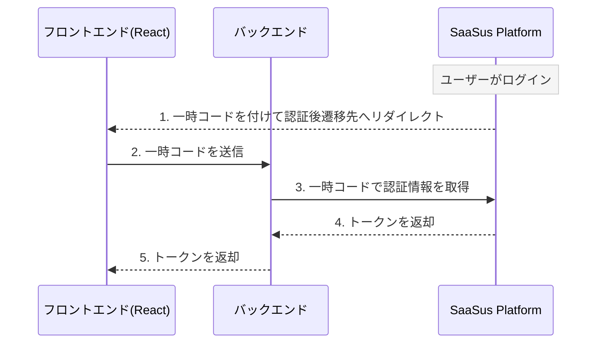
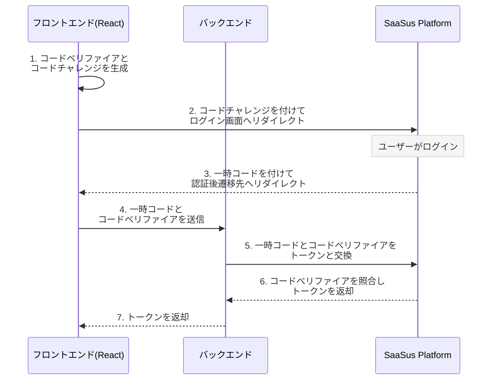

import Tabs from "@theme/Tabs";
import TabItem from "@theme/TabItem";

ホスト型ログイン画面を使う場合の認証フローに、PKCEによるログインCSRF対策を追加する手順を解説します。ここで示す変更を、現在のサンプルアプリの認証処理に加えることでPKCEに対応できます。

:::info
PKCEは任意の機能です。従来のフローは変更なしでそのまま動作するため、必要になった場合にのみPKCEを採用できます。
:::

## 概要

ホスト型ログイン画面を使うと、認証後遷移先に一時コードが渡され、アプリケーションはこれをトークンと交換します。第三者が用意した一時コードを被害者に交換させられると、ログインCSRF（認可コードインジェクション）攻撃が成立します。

PKCE（Proof Key for Code Exchange）は、一時コードをログインを開始したクライアントと紐付けることでこれを防ぎます。アプリケーションはログイン開始時に検証用の文字列（コードベリファイア）を生成し、そのハッシュ値（コードチャレンジ）だけをログイン画面に渡します。トークン交換時にはコードベリファイアを提示し、SaaSus Platform がこの組を照合します。別のセッション向けに発行された一時コードは交換できません。

従来方式とPKCE方式は、次の点が異なります。

- 従来方式：一時コードだけでトークンを取得します。
- PKCE方式：ログイン開始時にコードチャレンジを渡し、交換時にコードベリファイアを提示します。

## 処理フローの比較

従来方式は、一時コードだけでトークンを取得します。



PKCE方式は、ログイン開始時にコードチャレンジを、交換時にコードベリファイアを追加します。



## ログイン開始の受け口を設ける

PKCEを利用する場合、ログインの開始はアプリケーション側に用意した受け口（たとえば `/login` のようなパス）を経由させ、SaaSus Platform のログイン画面のURLへ直接アクセスする方法は使わないことを推奨します。

PKCEでは、ログイン開始時にアプリケーションがコードベリファイアを生成・保存し、そのハッシュであるコードチャレンジをログイン画面へ渡す必要があります。この生成と保存はアプリケーションのコードで行われるため、ログイン画面のURLを直接開くとコードベリファイアが保存されず、認証後のトークン交換が成立しません。

そのため、未ログイン時やログアウト時などログインを開始するすべての導線を、ログイン画面URLへの直接遷移ではなく、アプリケーション側の受け口（コードベリファイアを生成・保存してからログイン画面へリダイレクトする処理）へ集約しておくとよいでしょう。

## パラメータの生成

PKCEで使うパラメータは次のように生成します。

- コードベリファイア（`code_verifier`）：32バイトの乱数をBase64URLエンコードした文字列（例として43文字）。
- コードチャレンジ（`code_challenge`）：コードベリファイアのSHA-256ハッシュをBase64URLエンコードした文字列。
- 変換方式（`code_challenge_method`）：S256。

Base64URLエンコードでは `+`、`/`、`=` を使いません。`+` を `-` に、`/` を `_` に置き換え、末尾の `=` を取り除きます。

:::info
本ページで参照しているサンプルコードは、PKCE 対応版の作業ブランチ（`feature/...`）のものです。現時点では `main` ブランチには含まれていません。
:::

## フロントエンド実装

### ログイン開始の受け口（/login）

- [Login.tsx](https://github.com/saasus-platform/implementation-sample-front-react/blob/feature/pkce-dual-support/src/pages/Login.tsx)

PKCEログインの受け口です。`/login` にアクセスすると `redirectToLogin` が呼ばれ、code_verifier の生成・保存と code_challenge の付与を行ってから SaaSus Platform のログイン画面へ遷移します。

本実装サンプルで動作確認を行う場合は、ブラウザで `http://localhost:3000/login` にアクセスすると、PKCE でのログインを開始できます。

### PKCEパラメータの生成とログイン開始

- [pkce.ts](https://github.com/saasus-platform/implementation-sample-front-react/blob/feature/pkce-dual-support/src/pkce.ts)

PKCEのパラメータ生成とログイン画面へのリダイレクトをまとめたファイルです。`redirectToLogin` が、コードベリファイアを生成してセッションストレージに保存し、そのハッシュであるコードチャレンジと変換方式（S256）をログインURLに付与して、ログイン画面へリダイレクトします。前述のとおり、ログインを開始する各導線（未ログイン時やログアウト時など）は、ログインURLへの直接遷移ではなく、この `redirectToLogin` を経由させます。

### 認証後遷移先画面（Callback）

- [Callback.tsx](https://github.com/saasus-platform/implementation-sample-front-react/blob/feature/pkce-dual-support/src/pages/Callback.tsx)

認証後遷移先では、保存しておいたコードベリファイアを取り出し（`consumePkceCodeVerifier`）、一時コードとともにバックエンド（`POST /credentials`）へ送信してトークンを取得します。一時コードまたはコードベリファイアが無い場合は、ログインからやり直します。変更するのはトークン取得の部分だけで、トークン取得後の画面遷移など従来の処理はそのまま利用できます。

## バックエンド実装

フロントエンドから受け取った一時コードとコードベリファイアを、トークンと交換します。サンプルでは、フロントエンドからのリクエストを受けるエンドポイント（`POST /credentials`）のハンドラでこの処理を実装しています。

### エンドポイント一覧

<div className="table-scroll">
  <table className="nowrap-table">
    <thead>
      <tr>
        <th>種別</th>
        <th>メソッド &amp; パス</th>
        <th>説明</th>
      </tr>
    </thead>
    <tbody>
      <tr>
        <td>一時コード交換</td>
        <td><code>POST /credentials</code></td>
        <td>フロントエンドから一時コードとコードベリファイアを受け取り、トークンと交換して返却します。</td>
      </tr>
    </tbody>
  </table>
</div>

サンプルアプリのエンドポイント（`POST /credentials`）の実装は次のとおりです。

<Tabs>
<TabItem value="go" label="Go" default>

```go
// フロントエンドで生成・保持した code_verifier と、ホスト型ログイン画面から
// 返却された一時コード（code）を受け取り、トークンへ交換する。
func exchangeCredentials(c echo.Context) error {
	var request struct {
		Code         string `json:"code"`
		CodeVerifier string `json:"code_verifier"`
	}
	if err := c.Bind(&request); err != nil || request.Code == "" || request.CodeVerifier == "" {
		return c.JSON(http.StatusBadRequest, echo.Map{"error": "invalid authentication request"})
	}

	// 認証フローに一時コード認証を指定し、一時コードとコードベリファイアを渡す。
	code := authapi.Uuid(request.Code)
	body := authapi.ExchangeAuthCredentialsJSONRequestBody{
		AuthFlow:     authapi.ExchangeAuthCredentialsParamAuthFlowTempCodeAuth,
		Code:         &code,
		CodeVerifier: &request.CodeVerifier,
	}

	res, err := authClient.ExchangeAuthCredentialsWithResponse(c.Request().Context(), body)
	if err != nil {
		c.Logger().Errorf("failed to exchange credentials: %v", err)
		return c.String(http.StatusInternalServerError, "internal server error")
	}
	// 401（PKCE検証失敗など）はそのままフロントへ返し、エラー表示させる
	if res.JSON401 != nil {
		return c.JSON(http.StatusUnauthorized, res.JSON401)
	}
	if res.JSON404 != nil {
		return c.JSON(http.StatusNotFound, res.JSON404)
	}
	if res.JSON200 == nil {
		c.Logger().Errorf("failed to exchange credentials: %s", res.Body)
		return c.String(http.StatusInternalServerError, "internal server error")
	}

	return c.JSON(http.StatusOK, res.JSON200)
}
```

</TabItem>
</Tabs>

#### 実装例リンク

以下のリンク先に、本エンドポイントの実装が含まれています。  
関数名で検索して該当箇所をご確認ください。

- **Go (Echo)**: [`exchangeCredentials`](https://github.com/saasus-platform/implementation-sample-api-go/blob/feature/pkce-hosted-login/main.go)
- **その他の言語**: 準備中
