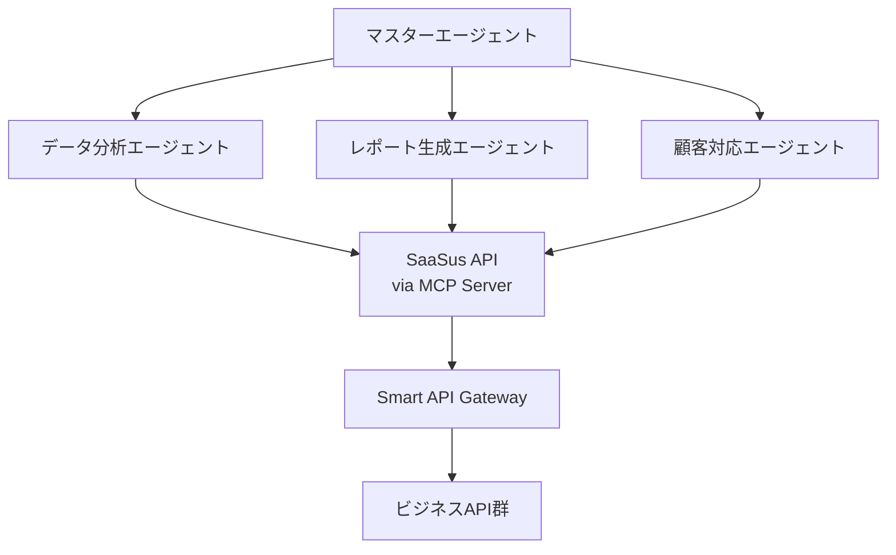

Smart MCP Server機能は、Smart API Gateway機能で公開したAPIを、Model Context Protocol（MCP）サーバーとして自動的に提供する革新的な機能です。  
AIエージェントやLLM（大規模言語モデル）がAPIを直接呼び出すことができるリモートMCPサーバーを、SaaSus Platformのコンソールから簡単な設定だけで公開できます。  
これにより、既存のAPIをAIエージェントが利用可能な形式で即座に提供し、AI駆動のアプリケーション開発を加速させることができます。なお、Smart MCP Server機能は SaaSus Platform の**全てのプラン**で利用可能です。

:::info
サンプルデモ動画の視聴や Smart MCP Server 機能のデモンストレーション、チュートリアルのサポート、導入検討のための情報収集、実装に関する技術相談をご希望の方は、以下のサポート申請フォームよりお問い合わせください。

[Smart MCP Server by SaaSus Platform サポート申請フォーム](https://forms.gle/XhFD9fCQv1zVGyRT9)<br/>
:::

## AI エージェントとAPIの連携における課題

従来のAIエージェントがAPIを利用する際には、以下のような課題がありました：

### 技術的複雑さ

- **カスタムプラグイン開発**: 各APIに対して専用のプラグインやアダプターを開発する必要
- **認証実装**: OAuth、API Key、JWTなど複数の認証方式への対応
- **エラーハンドリング**: APIエラーのAIエージェントへの適切な伝達
- **データ変換**: APIレスポンスのAIエージェントが理解可能な形式への変換

### 運用面の負担

- **APIスキーマの維持**: APIの変更に合わせたプラグインの更新
- **セキュリティ管理**: 各プラグインのセキュリティ監査と脆弱性対応
- **パフォーマンス最適化**: AIエージェントとAPIの通信速度向上
- **バージョン管理**: 複数のAPIバージョンへの対応

### スケーラビリティの問題

- **複数AIエージェント対応**: 異なるAIエージェントプラットフォームへの個別対応
- **大量リクエスト処理**: AIエージェントからの高頻度アクセスへの対応
- **リソース管理**: AI用途での予期せぬAPIコール増加への対応

## Smart MCP Server を使用しない場合のイメージ

MCPサーバーを手動で構築する場合、以下の開発・運用作業が必要になります：


### 手動実装に必要な作業

#### 1. MCPプロトコル実装
```typescript
// MCPサーバーの基本実装例
import { Server } from '@modelcontextprotocol/sdk/server/index.js';
import { StdioServerTransport } from '@modelcontextprotocol/sdk/server/stdio.js';

class CustomMCPServer {
  private server: Server;
  
  constructor() {
    this.server = new Server(
      {
        name: "custom-api-server",
        version: "1.0.0"
      },
      {
        capabilities: {
          tools: {}
        }
      }
    );
    
    // ツールの手動登録
    this.setupTools();
  }
  
  private setupTools() {
    // 各APIエンドポイントのツール定義を手動作成
    this.server.setRequestHandler('tools/list', async () => {
      return {
        tools: [
          {
            name: "get_inventory",
            description: "在庫情報を取得",
            inputSchema: {
              type: "object",
              properties: {
                tenantId: { type: "string" },
                productId: { type: "string" }
              }
            }
          }
          // 他のツールも手動定義...
        ]
      };
    });
  }
}
```

#### 2. API認証・認可の実装
```typescript
// 認証処理の実装
class AuthenticationHandler {
  async validateApiKey(apiKey: string): Promise<boolean> {
    // API Keyの検証ロジック
    const response = await fetch('/api/validate-key', {
      headers: { 'Authorization': `Bearer ${apiKey}` }
    });
    return response.ok;
  }
  
  async getTenantFromApiKey(apiKey: string): Promise<string> {
    // テナント情報の取得
    // 複雑な認証フローの実装が必要
  }
}
```

#### 3. スキーマ変換とデータマッピング
```typescript
// APIレスポンスのMCP形式への変換
class ResponseTransformer {
  transformInventoryResponse(apiResponse: any): MCPToolResult {
    // APIレスポンスをMCPツール結果に変換
    return {
      content: [
        {
          type: "text",
          text: this.formatInventoryData(apiResponse)
        }
      ]
    };
  }
  
  private formatInventoryData(data: any): string {
    // データフォーマットの変換ロジック
    // APIの仕様変更に合わせた継続的な更新が必要
  }
}
```

### 手動実装のデメリット

- **開発工数**: 初期実装に数週間から数ヶ月
- **保守コスト**: API変更のたびにMCPサーバーの更新が必要
- **品質リスク**: 手動実装によるバグやセキュリティ脆弱性
- **拡張性の限界**: 新しいAPIの追加や変更への対応が困難

## Smart MCP Server アーキテクチャ

Smart MCP Server機能では、これらの複雑な実装を自動化し、シンプルな設定だけでMCPサーバーを提供します：


### アーキテクチャの構成要素

#### 1. Smart API Gateway Layer
- **API管理**: 既存のSmart API Gateway機能で管理されたAPI
- **認証・認可**: 統一されたAPI Key認証システム
- **スロットリング**: レート制限とトラフィック制御
- **監査ログ**: 全てのAPI呼び出しの記録と追跡

#### 2. MCP Protocol Adapter
- **自動スキーマ変換**: APIスキーマからMCPツール定義への自動変換
- **リアルタイム同期**: API変更の即時反映
- **エラーハンドリング**: APIエラーのMCP形式への変換
- **パフォーマンス最適化**: 効率的なデータ転送とキャッシング

## Model Context Protocol（MCP）について

### MCPの概要

Model Context Protocol（MCP）は、Anthropic社が主導して開発されたオープンスタンダードで、AIエージェントが外部データソースやツールと安全かつ効率的に接続するためのプロトコルです。

### MCPの設計原則

#### 1. セキュリティファースト
- **権限分離**: 各ツールに最小限の権限のみを付与
- **暗号化通信**: 全ての通信がHTTPS/TLSで保護
- **認証制御**: 強力な認証メカニズムによるアクセス制御

#### 2. 相互運用性
- **標準化されたAPI**: 異なるAIエージェント間での互換性
- **プラットフォーム非依存**: 特定のAIプラットフォームに依存しない設計
- **拡張可能**: 新しい機能やツールの追加が容易

#### 3. パフォーマンス
- **効率的なプロトコル**: 最小限のオーバーヘッドで高速通信
- **並行処理**: 複数のツール呼び出しの同時実行
- **キャッシング**: 頻繁にアクセスされるデータの効率的な管理

### MCPの主要コンポーネント

#### ツール（Tools）
AIエージェントが実行できる個別の機能または操作です。

```json
{
  "name": "get_inventory",
  "description": "指定されたテナントの在庫情報を取得します",
  "inputSchema": {
    "type": "object",
    "properties": {
      "tenantId": {
        "type": "string",
        "description": "テナントの一意識別子"
      },
      "productId": {
        "type": "string", 
        "description": "製品の一意識別子（省略可能）"
      },
      "includeHistory": {
        "type": "boolean",
        "description": "履歴データを含めるかどうか",
        "default": false
      }
    },
    "required": ["tenantId"]
  }
}
```

#### リソース（Resources）
AIエージェントがアクセスできるデータソースや情報です。

```json
{
  "uri": "saasus://inventory/tenant-123",
  "name": "テナント123の在庫データ",
  "description": "リアルタイムの在庫情報と履歴データ",
  "mimeType": "application/json"
}
```

#### プロンプト（Prompts）
事前定義されたテンプレートやコンテキストです。

```json
{
  "name": "inventory_analysis",
  "description": "在庫分析レポートの生成",
  "arguments": [
    {
      "name": "period",
      "description": "分析期間（日数）",
      "required": true
    }
  ]
}
```

## 前提条件

Smart MCP Server機能を利用するための前提条件は以下の通りです：

### 技術的前提条件

#### 1. Smart API Gateway機能の設定完了
- **APIの公開**: 少なくとも1つのAPIエンドポイントが公開済み
- **認証設定**: API Key認証が適切に設定済み
- **権限設定**: 必要なロールと権限が定義済み

#### 2. SaaSus Platform環境
- **開発コンソールアクセス**: 管理者または開発者権限
- **テナント設定**: 有効なテナントが作成済み
- **課金設定**: 有効な課金プランが設定済み

#### 3. ネットワーク環境
- **HTTPS通信**: SSL/TLS証明書が適切に設定済み
- **ファイアウォール**: 必要なポートが開放済み
- **DNS設定**: ドメイン名が適切に解決可能

### 運用面の前提条件

#### 1. セキュリティポリシー
- **API Key管理**: 適切なキーローテーション戦略
- **アクセス制御**: 最小権限の原則に基づいた設定
- **監査ログ**: ログ記録と監視体制の整備

#### 2. 運用体制
- **監視体制**: システム監視とアラート設定
- **インシデント対応**: 障害発生時の対応手順
- **バックアップ**: データバックアップと復旧手順

:::info
Smart MCP Server機能は、Smart API Gateway機能の拡張機能として提供されます。<br/>
まずSmart API Gateway機能でAPIを公開してから、本機能をご利用ください。

詳細な設定手順については、[Smart API Gateway セットアップガイド](./manual.mdx)をご参照ください。
:::

## 主な機能

Smart MCP Server機能は、AIエージェントとAPIの連携を簡素化する包括的な機能セットを提供します：

### 1. 自動同時展開

#### シームレスな自動公開
- **同時展開**: Smart API GatewayでAPIが公開されると、MCPサーバーも自動的に同時展開
- **追加設定不要**: Smart API Gateway機能の設定完了と同時にMCPサーバーが利用可能
- **即座の利用開始**: APIの公開完了後すぐにAIエージェントからアクセス可能

#### 自動化されたプロセス
```yaml
# Smart API Gateway でのAPI公開
api_gateway:
  enabled: true
  endpoints:
    - "/api/inventory"
    - "/api/orders"

# ↓ 自動的に以下が同時展開される

# Smart MCP Server（自動生成・展開）
mcp_server:
  enabled: true  # 自動でtrue
  endpoint: "https://mcp.saasus.io/your-saas-id"
  tools:
    - "get_inventory"  # 自動生成
    - "create_order"   # 自動生成
```

### 2. 自動スキーマ変換

#### OpenAPI から MCP への変換
Smart API Gatewayで定義されたOpenAPIスキーマを、MCPツール定義に自動変換します：

```yaml
# OpenAPI定義（入力）
/api/inventory:
  get:
    summary: "在庫情報取得"
    parameters:
      - name: tenantId
        in: query
        required: true
        schema:
          type: string
    responses:
      '200':
        description: "成功"
        content:
          application/json:
            schema:
              type: object
              properties:
                products:
                  type: array
                  items:
                    $ref: '#/components/schemas/Product'
```

```json
// MCP ツール定義（自動生成）
{
  "name": "get_inventory",
  "description": "在庫情報取得",
  "inputSchema": {
    "type": "object",
    "properties": {
      "tenantId": {
        "type": "string",
        "description": "テナントID"
      }
    },
    "required": ["tenantId"]
  }
}
```

#### 複雑なデータ型の対応
- **ネストしたオブジェクト**: 階層構造を持つデータの適切な変換
- **配列とコレクション**: リスト形式データの効率的な処理
- **カスタム型**: 独自定義された複合データ型の変換
- **条件付きフィールド**: オプショナル項目と必須項目の適切な区別

### 3. 認証統合

#### 統一認証システム
既存のSmart API Gateway認証システムとシームレスに統合：

- **API Key継承**: 既存のAPI Keyがそのまま利用可能
- **テナント分離**: マルチテナント環境での適切な権限分離
- **ロールベースアクセス**: 細かい権限制御の継承
- **セッション管理**: 安全なセッション管理とタイムアウト制御

### 4. リアルタイム同期

#### 自動反映メカニズム
Smart API Gatewayでの変更が即座にMCPサーバーに反映：

- **スキーマ更新**: API定義の変更が自動でMCPツールに反映
- **権限変更**: アクセス権限の更新が即座に適用
- **エンドポイント追加**: 新しいAPIの自動追加
- **非推奨化対応**: 古いAPIの段階的な廃止管理

### 5. セキュアな接続

#### 通信セキュリティ
- **TLS 1.3暗号化**: 最新の暗号化プロトコルによる通信保護
- **証明書検証**: 正当なクライアントのみの接続を許可
- **中間者攻撃対策**: 証明書ピンニングによる高度なセキュリティ
- **データ完全性**: メッセージの改ざん検出と防止

## 利用シーン

Smart MCP Server機能は、様々なAIエージェントプラットフォームとの統合により、ビジネスプロセスの自動化と効率化を実現します：

### 1. OpenAI Playground での統合

#### 設定方法
OpenAI Playgroundでは、MCPサーバーを直接接続してAPIツールとして利用できます：

```json
{
  "mcpServers": {
    "business-api": {
      "url": "https://mcp.saasus.io/your-saas-id",
      "headers": {
        "Authorization": "Bearer your-api-key"
      }
    }
  }
}
```

#### 活用例
- **データ分析**: 「過去3ヶ月の売上データを分析して、トレンドを教えて」
- **レポート生成**: 「月次売上レポートを作成して、前年同月比較を含めて」
- **顧客管理**: 「新規顧客の登録手続きを自動化して」

### 2. Claude Desktop での統合

#### 設定ファイル
Claude Desktopでは、設定ファイルでMCPサーバーを登録します：

```json
{
  "mcpServers": {
    "saasus-api": {
      "command": "npx",
      "args": ["@modelcontextprotocol/server-fetch", "https://mcp.saasus.io/your-saas-id"],
      "env": {
        "MCP_API_KEY": "your-business-api-key"
      }
    }
  }
}
```

#### 業務活用例
- **営業支援**: 顧客情報の即座取得と商談履歴の分析
- **カスタマーサポート**: 問い合わせ内容の自動分類と適切な回答生成
- **在庫管理**: リアルタイム在庫状況の確認と自動発注提案

### 3. カスタムAIエージェントとの統合

#### Python エージェントでの利用
```python
import asyncio
from mcp import ClientSession, StdioServerParameters
from mcp.client.stdio import stdio_client

async def use_saasus_api():
    server_params = StdioServerParameters(
        command="npx",
        args=["@modelcontextprotocol/server-fetch", "https://mcp.saasus.io/your-saas-id"],
        env={"MCP_API_KEY": "your-api-key"}
    )
    
    async with stdio_client(server_params) as (read, write):
        async with ClientSession(read, write) as session:
            # 利用可能なツールを取得
            tools = await session.list_tools()
            
            # 在庫情報を取得
            result = await session.call_tool("get_inventory", {
                "tenantId": "tenant-123",
                "includeHistory": True
            })
            
            return result
```

#### Node.js エージェントでの利用
```javascript
import { Client } from '@modelcontextprotocol/sdk/client/index.js';
import { StdioClientTransport } from '@modelcontextprotocol/sdk/client/stdio.js';

class SaaSusAIAgent {
  constructor() {
    this.client = new Client({
      name: "saasus-ai-agent",
      version: "1.0.0"
    }, {
      capabilities: {}
    });
  }
  
  async connectToSaaSus() {
    const transport = new StdioClientTransport({
      command: "npx",
      args: ["@modelcontextprotocol/server-fetch", "https://mcp.saasus.io/your-saas-id"],
      env: { MCP_API_KEY: "your-api-key" }
    });
    
    await this.client.connect(transport);
  }
  
  async analyzeBusinessData() {
    // 売上データの取得
    const salesData = await this.client.request({
      method: "tools/call",
      params: {
        name: "get_sales_data",
        arguments: { period: "3months" }
      }
    });
    
    // 在庫データの取得
    const inventoryData = await this.client.request({
      method: "tools/call", 
      params: {
        name: "get_inventory",
        arguments: { includeHistory: true }
      }
    });
    
    return { sales: salesData, inventory: inventoryData };
  }
}
```

### 4. 業界特化型AIエージェント

#### Eコマース業界
```yaml
# ECサイト運営支援エージェント
agent_capabilities:
  - name: "商品管理"
    tools: ["get_products", "update_inventory", "manage_pricing"]
    description: "商品情報の自動更新と在庫管理"
  
  - name: "顧客分析"
    tools: ["get_customer_data", "analyze_behavior", "segment_customers"]
    description: "購買行動分析と顧客セグメンテーション"
  
  - name: "売上予測"
    tools: ["get_sales_history", "forecast_demand", "optimize_pricing"]
    description: "AIによる需要予測と価格最適化"
```

#### SaaS業界
```yaml
# SaaS運営支援エージェント
agent_capabilities:
  - name: "ユーザー管理"
    tools: ["manage_tenants", "track_usage", "handle_billing"]
    description: "テナント管理と使用量監視"
  
  - name: "チャーン予測"
    tools: ["analyze_usage_patterns", "predict_churn", "suggest_interventions"]
    description: "解約リスクの早期発見と対策提案"
  
  - name: "プロダクト最適化"
    tools: ["collect_feedback", "analyze_features", "prioritize_development"]
    description: "機能利用分析と開発優先度決定"
```

### 5. マルチエージェントシステム

#### 協調動作する複数エージェント


#### エージェント間連携の例
```typescript
// マスターエージェントによる作業分散
class MasterAgent {
  async processBusinessRequest(request: string) {
    // 1. データ分析エージェントにデータ取得を依頼
    const analysisAgent = new DataAnalysisAgent();
    const rawData = await analysisAgent.fetchBusinessData();
    
    // 2. レポート生成エージェントにレポート作成を依頼
    const reportAgent = new ReportGenerationAgent();
    const report = await reportAgent.generateReport(rawData);
    
    // 3. 顧客対応エージェントに結果の伝達を依頼
    const customerAgent = new CustomerServiceAgent();
    await customerAgent.notifyCustomer(report);
    
    return report;
  }
}
```

### 6. 実際の導入効果

#### 導入前後の比較

| 項目 | 導入前 | 導入後 | 改善効果 |
|------|--------|--------|----------|
| データ取得時間 | 30分〜2時間 | 2〜5分 | **90%短縮** |
| レポート作成工数 | 4〜8時間 | 30分〜1時間 | **85%削減** |
| 人的エラー率 | 5〜10% | 1%未満 | **90%削減** |
| 意思決定速度 | 1〜3日 | リアルタイム | **即時化** |

#### ROI（投資対効果）
- **初期導入コスト**: 既存Smart API Gateway利用料のみ（追加費用なし）
- **運用コスト削減**: 月間20〜40時間の工数削減
- **意思決定の迅速化**: ビジネス機会の早期発見と対応
- **品質向上**: 人的エラーの大幅削減による信頼性向上