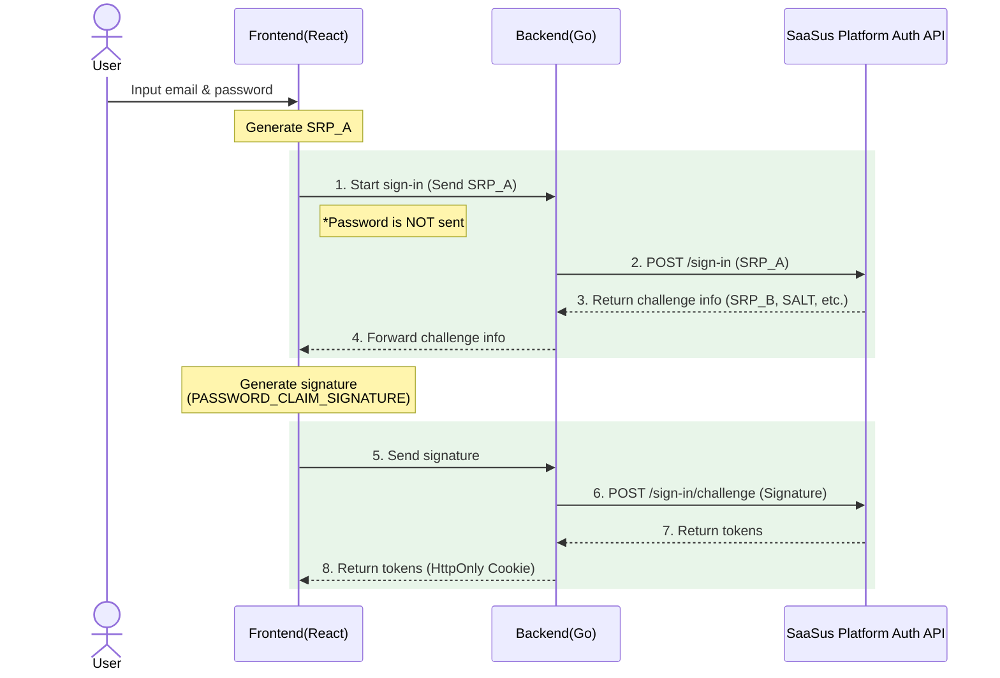

This document provides an overview of implementing login functionality using the SaaSus Platform Login API with a custom login UI.

:::info
For detailed implementation code, see [Login Implementation](/docs/part-6/implementation-guide/auth/sign-in).
:::

## What is the Login API?

The Login API allows SaaS providers to implement login functionality from their own custom-built UI, without using the standard hosted login screen provided by SaaSus Platform.

By calling the SaaSus Platform Auth API (`/sign-in` and `/sign-in/challenge`) from your server-side application, you can obtain ID tokens, access tokens, and refresh tokens for subsequent API calls and authorization.

This document explains how to implement login functionality using a custom login UI with the Login API.

## What You Can Do with the Login API

### Custom Login UI with Email + Password Authentication

Perform login from your own branded UI without using the SaaSus Platform standard login screen. You have full control over the login screen design and UX.

### Token Acquisition (ID / Access / Refresh Tokens)

Upon successful authentication, you can obtain the tokens required for SaaSus Platform API calls.

## Authentication Flow and Architecture

The Login API is based on a **two-step authentication flow** using the Secure Remote Password (SRP) protocol. Instead of simply sending a password, it performs authentication securely through a challenge-and-response mechanism.

### Authentication Flow Overview

### Flow Details

1. **Authentication Start**: Enter the email address (or ID) and password on the frontend, generate SRP_A, and send it to the backend (the password is **not** sent).
2. **Challenge Info Acquisition**: The backend sends SRP_A to the SaaSus Platform Auth API's `/sign-in`.
3. **Challenge Info Received**: Challenge information (SRP_B, SALT, SECRET_BLOCK, etc.) is returned from the SaaSus Platform Auth API to the backend.
4. **Challenge Info Forwarded**: The backend returns the challenge information to the frontend.
5. **Signature Generation and Transmission**: The frontend generates a signature (`PASSWORD_CLAIM_SIGNATURE`, etc.) using the received challenge information and sends it to the backend.
6. **Verification Request**: The backend sends the signature and challenge information to the SaaSus Platform Auth API's `/sign-in/challenge`.
7. **Token Issuance**: Upon successful authentication, ID token, access token, and refresh token are returned to the backend.
8. **Token Storage**: The backend returns the tokens to the frontend via HttpOnly Cookies.

:::info Benefits of SRP Protocol
The SRP (Secure Remote Password) protocol never transmits the password in plaintext over the network. Authentication is performed through hashing and SRP calculations, making it secure even against man-in-the-middle attacks. Since completing SRP calculations on the frontend alone is complex, this sample application demonstrates an architecture where the frontend handles SRP_A and signature generation, while the backend mediates communication with the SaaSus Platform API.
:::

### Challenge Types and Branching Logic

The following challenge types may be returned from the SaaSus Platform Auth API:

| Challenge Name | Description | Action |
|---|---|---|
| `PASSWORD_VERIFIER` | Standard password verification | Send challenge response to obtain tokens |
| `NEW_PASSWORD_REQUIRED` | Password change required on first login | Prompt for new password and send challenge again |

## Sample Application Structure

The sample application in this implementation guide is built with the following stack:

| Component | Technology |
|---|---|
| Frontend | React + TypeScript |
| Backend | Go |
| Token Management | HttpOnly Cookie |
| Security | CSRF Protection |

### Implemented Screens and Features

- **Login Screen**: Email address (or ID) + password input form
- **New Password Screen**: Password change on first login
- **Login API**: SRP authentication flow with SaaSus Platform Auth API
- **Token Management**: Secure token storage via HttpOnly Cookies
- **Logout**: Session termination via cookie clearing

For detailed implementation, see [Login Implementation](/docs/part-6/implementation-guide/auth/sign-in).
